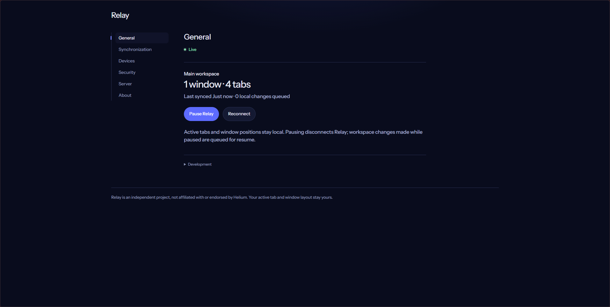
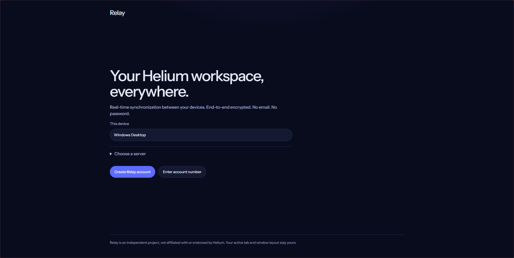
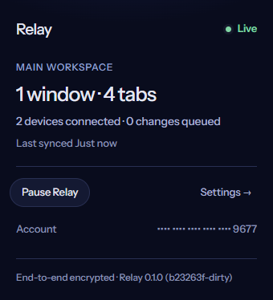

# Relay

**End-to-end encrypted browser workspace sync for Chromium.**

Relay is an open-source browser extension and Cloudflare backend that keeps tabs, windows, and supported tab groups synchronized across Chromium-based browsers without giving the sync service access to your browsing workspace.

## Demo

Account creation, device setup, and live synchronization in action:

https://github.com/user-attachments/assets/892100c9-1324-4502-83f7-7dbcdd6c6a55

<p align="center">
  
</p>

<table>
  <tr>
    <td width="72%">
      
    </td>
    <td width="28%">
      
    </td>
  </tr>
  <tr>
    <td align="center"><strong>Private, passwordless onboarding</strong></td>
    <td align="center"><strong>Sync status at a glance</strong></td>
  </tr>
</table>

## Why Relay exists

Browser sync is usually tied to a vendor account. Relay takes a different approach: devices hold the keys, workspace state is encrypted before leaving the browser, and the server primarily coordinates ciphertext between authorized devices.

The result is a synchronized browser workspace that can continue recording changes while offline, recover cleanly after reconnecting, and be self-hosted without giving the server access to tab contents.

## What Relay syncs

* **Tabs and windows** — HTTP/HTTPS tabs, remote PDFs, new tabs, navigation, ordering, pinning, cross-window moves, closures, and multiple windows.
* **Tab groups** — title, color, membership, grouping, ungrouping, and cross-window structure. Collapse state remains local.
* **Offline changes** — encrypted local changes are journaled while disconnected and reconciled against canonical revisions and checkpoints after reconnecting.
* **Device pairing** — new devices join through an approval flow with a committed, user-verifiable six-digit SAS.
* **Device lifecycle** — recovery enrollment, device revocation, per-device key provisioning, workspace-key rotation, and best-effort online vault wipe.
* **Encrypted local state** — workspace state, the local journal, device identity, and browser-to-workspace mappings are persisted in an encrypted local vault.
* **Conflict handling** — durable mutation expectations, sender sequence numbers, canonical revisions, and bounded navigation tracking reduce sync loops and prevent stale destructive updates.
* **Protected-page handling** — local-only and browser-protected tabs stay local instead of being replaced with fake placeholders on peer devices.

### Intentionally local

Relay does **not** synchronize:

* active-tab focus
* window geometry
* scroll position
* incognito state
* cookies
* logins
* site storage
* bookmarks
* browsing history

Browser-internal pages, local files, extension pages, and other protected URLs also remain local.

## How it works

```text
Browser extension
├─ observes tabs, windows, and groups
├─ updates the encrypted local vault
└─ creates signed + encrypted operations
                     │
                     ▼
           HTTPS synchronization
           + WebSocket change hints
                     │
                     ▼
      Cloudflare Worker + RelayAccount
              Durable Object
      ├─ canonical revisions
      ├─ encrypted operations
      ├─ encrypted checkpoints
      └─ public coordination state
                     │
                     ▼
        peer devices pull changes
          verify → decrypt → reconcile
                     │
                     ▼
              Browser extension
```

Browser events are first applied to a local journal. Relay then sends signed, encrypted envelopes to the account's Durable Object.

The server assigns canonical revisions and stores encrypted operations and checkpoints in SQLite-backed Durable Object storage. Hibernating WebSockets are used only for lightweight change hints and revocation notices; clients still pull, verify, decrypt, and reconcile canonical state themselves.

Concurrent non-destructive edits resolve according to accepted server revision. Stale deletes are rejected when another device changed the resource after the operation's base revision. Expected-mutation records, identity checks, sequence watermarks, and bounded navigation tracking help prevent remotely applied changes from being mistaken for new local edits.

## Security and privacy

Relay is designed so the coordination service does not need access to synchronized workspace contents.

* Workspace data is encrypted on devices with **AES-256-GCM**.
* Device signing and key agreement use **P-256 ECDSA/ECDH**.
* Private device keys are stored as non-extractable `CryptoKey` objects in the browser's IndexedDB-backed vault.
* A new device must be approved by an already authorized device.
* Pairing commits both sides of an ephemeral key exchange and requires matching six-digit SAS values before workspace keys are provisioned.
* Device revocation creates a new workspace-key epoch and reprovisions only retained devices.
* An online revoked device verifies the signed removal chain, clears its Relay vault, disconnects, and leaves its existing browser tabs untouched.
* Device names and membership metadata are carried in signed control records and encrypted where they form part of workspace state.
* Pending pairing requests do not expose friendly device names or page data.
* The account number identifies the server-side Durable Object but is **not** an encryption key or authorization credential.
* Account recovery uses a separate recovery secret and signing identity.

The Worker coordinates ciphertext and cannot decrypt synchronized tab data.

Relay still assumes the browser, operating system, installed extension, and currently authorized devices are trusted. The server can observe metadata such as traffic timing, message sizes, revisions, IP addresses, and public membership records.

For the full security model and remaining limitations, see the [threat model](docs/THREAT-MODEL.md).

## Repository structure

```text
apps/
├─ extension/    Chromium extension, UI, browser adapters,
│                local vault, and synchronization lifecycle
└─ server/       Cloudflare Worker and RelayAccount Durable Object

packages/
├─ protocol/     Wire messages, encrypted workspace envelopes,
│                reconciliation, membership controls, and tab groups
├─ crypto/       Web Crypto primitives, envelopes, key wrapping,
│                recovery, and committed pairing
└─ shared/       URL policy, configuration, limits, and validation
```

Relay is built with:

* TypeScript
* pnpm workspaces
* Web Crypto
* Cloudflare Workers
* Durable Objects + SQLite
* Wrangler
* Vitest
* Playwright
* Biome

## Development

### Requirements

* Node.js 22.12 or newer
* pnpm 10.20.0

Install dependencies and start the local Worker and development extension build:

```sh
pnpm install
pnpm dev
```

Then load `apps/extension/dist` as an unpacked extension in two separate Chromium browser profiles.

During onboarding, choose:

```text
http://localhost:8787
```

Local Wrangler state is stored under:

```text
apps/server/.wrangler/state
```

when using the LAN server mode.

### Quality checks

```sh
pnpm lint
pnpm typecheck
pnpm test
pnpm build
```

### Browser end-to-end tests

Keep the local server running, install the Playwright Chromium build once, then run:

```sh
pnpm exec playwright install chromium
pnpm test:e2e
```

See the [development guide](docs/DEVELOPMENT.md) for the two-profile workflow and manual test scenarios.

See [self-hosting](docs/SELF-HOSTING.md) for Cloudflare deployment and custom Worker origins.

## Project status

Relay is functional pre-release software (`0.1.0`).

It has **not** received an independent security review and has not been released on the Chrome Web Store. The current implementation is a single-account device synchronization system in which authorized devices are equally privileged.

Not currently implemented:

* account migration
* bookmark synchronization
* history synchronization
* nested tab groups
* Firefox support
* forward-secrecy ratcheting
* guaranteed remote erasure

Additional implementation and design documentation:

* [Architecture](docs/ARCHITECTURE.md)
* [Protocol](docs/PROTOCOL.md)
* [Cryptography](docs/CRYPTOGRAPHY.md)
* [Threat model](docs/THREAT-MODEL.md)
* [Development](docs/DEVELOPMENT.md)
* [Self-hosting](docs/SELF-HOSTING.md)

## License

Relay is licensed under [AGPL-3.0-or-later](LICENSE).

See [TRADEMARKS.md](TRADEMARKS.md) for branding notes.

Relay is independent of Helium and is not affiliated with or endorsed by Helium.
